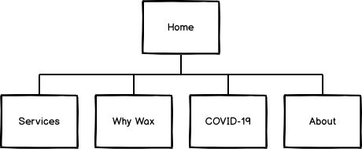

# By Samantha Brooker
#### Code Institute Full Stack Development Diploma: Milestone Project 1 - User Centric Frontend Development
##### by Barry MacLennan

## Contents

1. [UX Development](#uxdev)
   - Project Goals
   - User Goals
   - User Stories
   - Site Owner Goals
   - User Requirements & Expectations
   - Design Choices
      - Fonts
      - Icons
      - Colours
   - Wireframes
   - Features & Future Releases 
2. [Testing](#testing)
3. [Bugs and De-bugging](#bugs)
4. [Technologies Used](#tech)
   - Languages Used
   - Tools & Libraries Used
5. [Project Deployment](#deployment)
   - Deployment
   - Creating a Local Version
6. [References](#references)
7. [Acknowledgements](#acknowledge)

-------------

## UX Development 
### Project Goals

### User Goals

The process for creating the site for the client can be found [here](#) for reference.

### User Stories

### Site Owner Goals
The site owner has the following goals that they wish to achieve from this project:
- To 

### User Requirements & Expectations

### Design Choices
#### Fonts 
#### Icons
#### Colours

### Wireframes
To help ensure that the site contains all of the required information I have created simple wireframes as a framework, using the User Stories and Site Owner Goals to ensure that all of the required features for this release are present.

The site is made up of 5 pages, which are shown in the below sitemap:

All of the wireframes were created mobile first, with subsequent wireframes showing the view on a tablet and desktop.
The wireframes show:
- Home page
- Treatments page
- Why Wax page
- COVID-19
- About

Below is the wireframe for the Home page, each of the others can be found following the links in the list above.

### Features & Future Releases

_[Back to Contents](#Contents)_

-------------

## Testing 
- HTML and CSS check using WC3

_[Back to Contents](#Contents)_

-------------
## Bugs and De-bugging 

_[Back to Contents](#Contents)_

-------------
## Technologies Used 

### Languages Used
- HTML5 - base content creation
- CSS3 - site styling
- Javascript - Although not in scope to be used, was required to deliver responsive menu functionality

### Tools and Libraries Used
- GitPod, Git and GitHub - Used to create code, manage version control and host the project
- Balsamiq - Wireframing tool for README and project planning stages
- Bootstrap - CSS framework for page layouts
- google fonts - all fonts in use on the site  
- Cooolors.co - a hex color pallette building site
- Font Awesome - for iconography throughout the site
- pexels - royalty free stock images

_[Back to Contents](#Contents)_

--------------
## Project Deployment 

Detailed below is how this project has been deployed and also contains information should you wish to use locally on your machine. The project has been created and managed using Git in GitPod pushing all code to GitHub which is included in the below instructions.

### Deployment:
- Once project was pushed to **GitHub**, I went to the [GitHub](https://github.com/) site
- Logged in using my username and password
- Navigated to the correct repository page **[bazmac81/CI-MSP1-bySamB](https://github.com/bazmac81/CI-MSP1-bySamB)**
- Clicked on the **Settings** option
- Scrolled down to the **"GitHub Pages"** section
- Selected the **"master branch"** as the **source**
- Confirmed my selection to maked the page live
- by Samantha Brooker is now live using GitHub Pages
- *Note: There may be a short delay from selecting the source to the page going live. You will see a green background where your site address is shown to confirm when the page is live*

### Creating a Local Version:
1. Navigate to the correct repository page **[bazmac81/CI-MSP1-bySamB](https://github.com/bazmac81/CI-MSP1-bySamB)**
2. Click the green **Clone** button
3. Depending on how you wish to access the files you can either:
   - **Copy** the **https:** link displayed using the **clipboard** icon
   - Open the **Terminal** on your machine
   - Change the current directory to where you wish to save these files to
   - Type `git clone https://github.com/bazmac81/CI-MSP1-bySamB`
   - Press **Enter** to create your local files \
_or_
   - Click the **Download.zip** to download a zip file
   - Once downloaded, extract this to your chosen directory
4. Full details and support for creating a clone can be found [here](https://help.github.com/en/github/creating-cloning-and-archiving-repositories/cloning-a-repository)

_[Back to Contents](#Contents)_

-------------
## References 

Support files on Code Institute's Slack space:
- [Getting Started on First Milestone Project](https://code-institute-room.slack.com/files/UNVL7B49K/F0145CW2CRZ/ucfd_call_22may2020.pdf)
- [Wireframe to Wire-Fame!](https://code-institute-room.slack.com/files/UNVL7B49K/F014YTXNVEF/ucfd_call_5june2020.pdf)

Reference sites to build knowledge on technologies covered in the first 3 modules of the course; HTML Fundamentals, CSS Fundamentals, and User Centric Frontend Development:
- [coomonmark.org](https://commonmark.org/help/) - to better understand markd down for creating the README.md file
- [Stormotion.io](https://stormotion.io/blog/how-to-write-a-good-user-story-with-examples-templates/) - Tips on how to write good User Stories

_[Back to Contents](#Contents)_

-------------
## Acknowledgements 
Thanks go to a  number of people that have helped support me in pulling together my first project.

My mentor Can, thanks for your time and guiding me through pulling this together.

Fellow students for sharing their work as examples:
* Neringa for sharing her [README](https://code-institute-room.slack.com/archives/C010RUUFGDQ/p1593428792383000) example to test my first one against\
* Aukje - byIlsa for sharing her [README](https://code-institute-room.slack.com/archives/C010RUUFGDQ/p1593428841383600) example to test my first one against\

The team on Slack for their general helpfulness and motivation!

_[Back to Contents](#Contents)_
