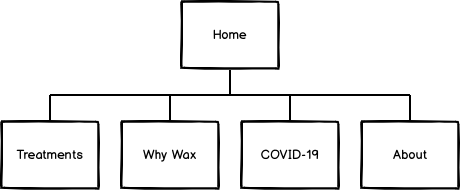
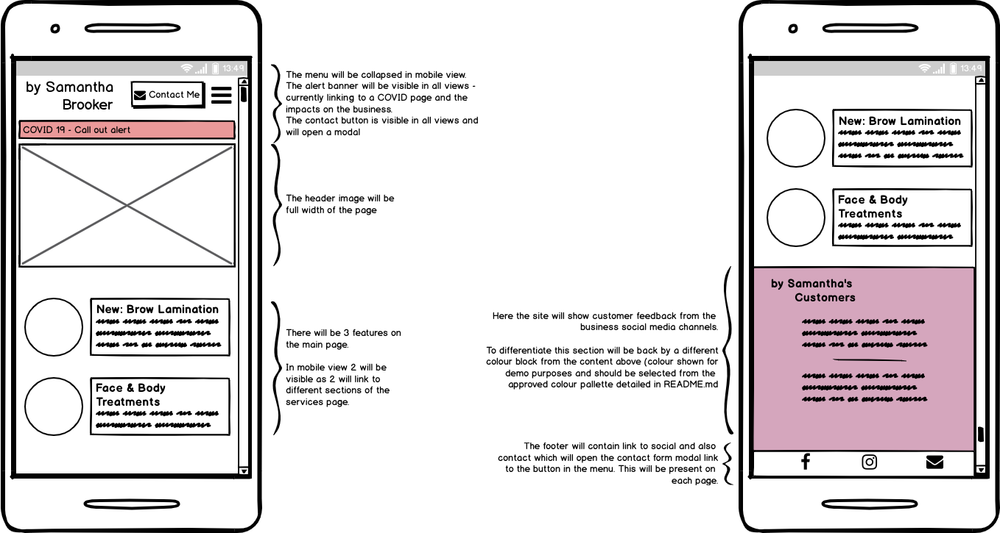
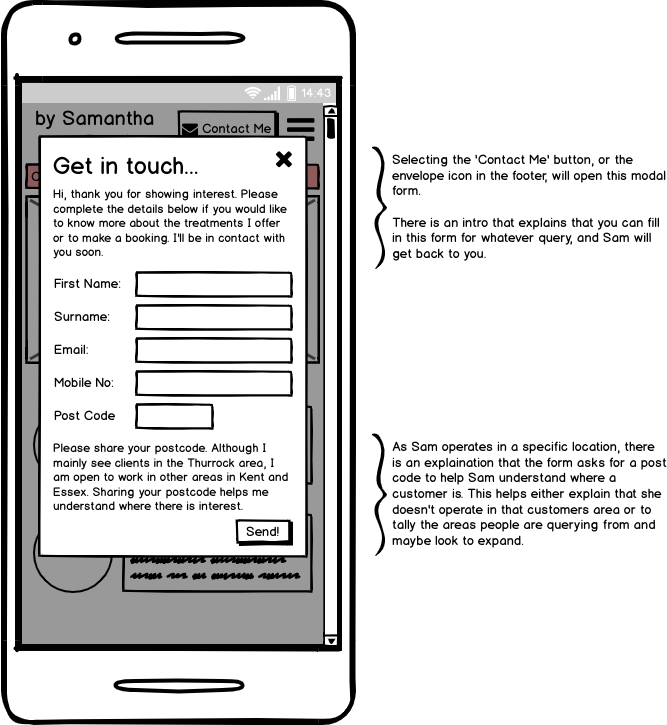

# By Samantha Brooker
#### Code Institute Full Stack Development Diploma: Milestone Project 1 - User Centric Frontend Development
##### by Barry MacLennan

## Contents

1. [UX Development](#uxdev)
   - Project Goals
   - User Goals
   - User Stories
   - Site Owner Goals
   - User Requirements & Expectations
   - Design Choices
      - Fonts
      - Icons
      - Colours
   - Site Map and Wireframes
   - Features & Future Releases 
2. [Testing](#testing)
3. [Bugs and De-bugging](#bugs)
4. [Technologies Used](#tech)
   - Languages Used
   - Tools & Libraries Used
5. [Project Deployment](#deployment)
   - Deployment
   - Creating a Local Version
6. [References](#references)
7. [Acknowledgements](#acknowledge)

-------------

## UX Development 
### Project Goals

This site is to support a beauty business, By Samantha Brooker, which operates in the Thurrock area of Essex. Sam runs a mobile beauty business and has mainly been relying on her Facebook page to drive business. The website will give her more control over the information available to customers and to allow them to contact her should they wish to employ her services.

After an initial consultation with Sam we have been able to identify the following possible features that she would like to have available and that customers would expect to see when visiting and using the site.

### User Goals
Users of this site will be visiting for a number of reasons byt the primary reasons will be:
- Find you what treatments and services Sam has to offers
- Find out the cost of the treatments and services Sam offers
- Book an appiontment for a treatment with Sam.

In a fully functioning web app, users would expect to be able to pay for their appointment online. Particularly as contactless and card paymetns rise in place of cash payemnts.

Below you will find more detailed user stories that help define the above goals and will be used in determing the feature set of the web site in this first release.

### User Stories
The users for this site will be women. As the site at this stage is a static site without functionality, all users will be classed as **site visitor**. For user stories to cater for future features we would introduce a **client** user. This would be a user that is registered with the site and is looking to interact in some way i.e. make or amend a booking.

- As a **site visitor**, I want to find a **list of services** so that I can **find the treatment I require**
- As a **site visitor**, I want to find the **prices for the treatments** available so I can **understand the cost of a treatment and any offers**
- As a **site visitor**, I want to find **contact details** so that I can **enquire about a treatment or a potential booking**
- As a **site visitor** I want to find **more about the business practice** so that I can **understand what makes this different from other businesses**
- As a **site visitor**, I want to find information on **how the business is going to manage with COVID** so I am confident **I can book safely**
- As a **site visitor** I  want to find **customer testimonials** to help understand **quality of service**
- As a **site visitor** I want to find links to the **business social media** and see other customers reactions and satisfaction to **verify quality of service**
- As a **site visitor** I want to find information on **why waxing would be better than other methods of hair removal** to understand **level of experience** of business
- As a **site visitor** I want to find information on the **locations that this business operates in** so that I can understand if **I can book a treatment**

### Site Owner Goals
The site owner has the following goals that they wish to achieve from this project:
- Show what the **business is about**
- Highlight the **uniqueness of business - Sam herself**. A customer will be seen by her **personally** each time.
- Linked with **Sam’s social media channels** to showcase customer / service quality & scope to build a **level of trust**
- Allow customers to **make contact with Sam** for general enquiries
- Allow customers to **make a booking**
- Be mobile friendly with a **responsive layout design** for a smooth desktop experience
- Be **clean and simple** in design and not be perceived as overloaded and cluttered with excessive content
- Allow customers to **make full or part payments** and track this for easy management of bookings and payments

### User Requirements & Expectations

### Design Choices
Sam has been using a logo on some of her social media channels since she setup her business. The thing she was keen to do was ensure it represents the personal touch that comes from her being a sole trader and the person that her customers will interact with.

Sam was happy for me to develop her logo further so I provided 3 options for her to choose from. 

I have created a design folder to hold the sample files relating to this project for reference. These design options can be found [here](design/designoptions.html) and include logo samples, font choices and colours, which are listed in a little more detail below.

#### Fonts 
In keeping with the logo font I wanted to provide fonts that felt a little crafted and not too modern or system generated. I found these pairings in Google Fonts and put them together in a collection for Sam to choose her preferred combination. The key was they were easy to read as well as suiting the them of the site.

#### Colours
Sam already had some simple colours in her logo,which are bronze to dusky pink gradient. I wanted to expand on these colours to add more interest to the site but still keep in mind the style and theme. These colours a muted and soft. Also when building the site contrast needs to be a factor and so these colour combinations should give the site personality while also allowing the content to be easily seen / read.

#### Icons
In addition to the fonts and colourway, there are a few icons to be used through the site. These are sourced from Font Awesome and will be used for Contact Me and social media links. 

The final choices Sam made can be found [here](design/designfinal.html)

### Site Map and Wireframes
To help ensure that the site contains all of the required information I have created simple wireframes as a framework, using the User Stories and Site Owner Goals to ensure that all of the required features for this release are present.

The site is made up of 5 pages, which are shown in the below sitemap:

All of the wireframes were created mobile first, with subsequent wireframes showing the view on a tablet and desktop.
Below is the wireframe for the Home page in mobile view.

As the Contact Me section isn't a page but a modal, you can see how this will behave below. Each of the other pages and device views can be found using the links that follow:

- Home page: [Tablet](design/wireframe/hometabletview.png) | [Desktop](design/wireframe/homedesktopview.png)
- Treatments page: [Mobile](design/wireframe/treatmentsmobileview.png) | [Tablet](design/wireframe/treatmentstabletview.png) | [Desktop](design/wireframe/treatmentsdesktopview.png)
- Why Wax page: [Mobile](design/wireframe/) | [Tablet](design/wireframe/) | [Desktop](design/wireframe/)
- COVID-19: [Mobile](design/wireframe/covidmobileview.png) | [Tablet](design/wireframe/covidtabletview.png) | [Desktop](design/wireframe/coviddesktopview.png)
- About: [Mobile](design/wireframe/aboutmobileview.png) | [Tablet](design/wireframe/abouttabletview.png) | [Desktop](design/wireframe/aboutdesktopview.png)
- Contact (modal): [Tablet](design/wireframe/contacttabletview.png) | [Desktop](design/wireframe/contactdesktopview.png)

### **Features & Future Releases**
Based on what Sam is looking to achieve and what customers would expect to achieve from visiting her site, a fully functional site should contain the following features to be relevant and fit the needs:

- Show what the business is about
- Highlight the uniqueness of business - Sam herself. A customer will be seen by her personally each time.
- Linked with Sam’s social media channels to showcase customer / service quality & scope to build a level of trust
- Allow customers to make contact with Sam for general enquiries
- Allow customers to make a booking
- Be mobile friendly with a responsive layout design for a smooth desktop experience
- Be clean and simple in design and not be perceived as overloaded and cluttered with excessive content
- Allow customers to make full or part payments and track this for easy management of bookings and payments

For this first release we will be focusing on the features listed in v1.0 scheduled for release July 2020, with the remaining features appearing in future releases:

*by Samantha Brooker v1.0 - Release July 2020*:
- Show what the business is about
- Highlight the uniqueness of business - Sam herself. A customer will be seen by her personally each time.
- Allow customers to make contact with Sam for general enquiries
- Be mobile friendly with a responsive layout design for a smooth desktop experience
- Be clean and simple in design and not be perceived as overloaded and cluttered with excessive content

*by Samantha Brooker v2.0 (Release date TBC)*:
- Linked with Sam’s social media channels to showcase customer / service quality & scope to build a level of trust
- Allow customers to make a booking

*by Samantha Brooker v3.0 (Release date TBC)*:
- Allow customers to make full or part payments and track this for easy management of bookings and payments

_[Back to Contents](#Contents)_

-------------

## Testing 
- HTML and CSS check using WC3

_[Back to Contents](#Contents)_

-------------
## Bugs and De-bugging 

_[Back to Contents](#Contents)_

-------------
## Technologies Used 

### Languages Used
- HTML5 - base content creation
- CSS3 - site styling
- Javascript - Although not in scope to be used, was required to deliver responsive menu functionality

### Tools and Libraries Used
- GitPod, Git and GitHub - Used to create code, manage version control and host the project
- Balsamiq - Wireframing tool for README and project planning stages
- Bootstrap - CSS framework for page layouts
- google fonts - all fonts in use on the site  
- Cooolors.co - a hex color pallette building site
- Font Awesome - for iconography throughout the site
- pexels - royalty free stock images

_[Back to Contents](#Contents)_

--------------
## Project Deployment 

Detailed below is how this project has been deployed and also contains information should you wish to use locally on your machine. The project has been created and managed using Git in GitPod pushing all code to GitHub which is included in the below instructions.

### Deployment:
- Once project was pushed to **GitHub**, I went to the [GitHub](https://github.com/) site
- Logged in using my username and password
- Navigated to the correct repository page **[bazmac81/CI-MSP1-bySamB](https://github.com/bazmac81/CI-MSP1-bySamB)**
- Clicked on the **Settings** option
- Scrolled down to the **"GitHub Pages"** section
- Selected the **"master branch"** as the **source**
- Confirmed my selection to maked the page live
- by Samantha Brooker is now live using GitHub Pages
- *Note: There may be a short delay from selecting the source to the page going live. You will see a green background where your site address is shown to confirm when the page is live*

### Creating a Local Version:
1. Navigate to the correct repository page **[bazmac81/CI-MSP1-bySamB](https://github.com/bazmac81/CI-MSP1-bySamB)**
2. Click the green **Clone** button
3. Depending on how you wish to access the files you can either:
   - **Copy** the **https:** link displayed using the **clipboard** icon
   - Open the **Terminal** on your machine
   - Change the current directory to where you wish to save these files to
   - Type `git clone https://github.com/bazmac81/CI-MSP1-bySamB`
   - Press **Enter** to create your local files \
_or_
   - Click the **Download.zip** to download a zip file
   - Once downloaded, extract this to your chosen directory
4. Full details and support for creating a clone can be found [here](https://help.github.com/en/github/creating-cloning-and-archiving-repositories/cloning-a-repository)

_[Back to Contents](#Contents)_

-------------
## References 

Support files on Code Institute's Slack space:
- [Getting Started on First Milestone Project](https://code-institute-room.slack.com/files/UNVL7B49K/F0145CW2CRZ/ucfd_call_22may2020.pdf)
- [Wireframe to Wire-Fame!](https://code-institute-room.slack.com/files/UNVL7B49K/F014YTXNVEF/ucfd_call_5june2020.pdf)

Reference Books I have used when building this site:
- [HTML & CSS: Design and build websites by Jon Duckett](http://www.htmlandcssbook.com/) - to easily look up key terms / attribute names etc.

Reference sites to build knowledge on technologies covered in the first 3 modules of the course; HTML Fundamentals, CSS Fundamentals, and User Centric Frontend Development:
- [coomonmark.org](https://commonmark.org/help/) - to better understand markd down for creating the README.md file
- [Stormotion.io](https://stormotion.io/blog/how-to-write-a-good-user-story-with-examples-templates/) - Tips on how to write good User Stories
- [lullabot.com](https://www.lullabot.com/articles/what-heck-aria-beginners-guide-aria-accessibility) - to understand more on ARIA in making websites accessible
- [medium.com](https://medium.com/coder-grrl/the-guide-to-customising-the-bootstrap-4-navbar-i-wish-id-had-6-months-ago-7bc6ce0e3c71) - Better understand how to manipulate the navbar elements of Bootstrap
- [codepen.io](https://codepen.io/davecross/pen/dpNAQg) - used to create a hover effect for the nav bar links
_[Back to Contents](#Contents)_

-------------
## Acknowledgements 
Thanks go to a  number of people that have helped support me in pulling together my first project.

My mentor Can, thanks for your time and guiding me through pulling this together.

Fellow students for sharing their work as examples:
* Neringa for sharing her [README](https://code-institute-room.slack.com/archives/C010RUUFGDQ/p1593428792383000) example to test my first one against\
* Aukje - byIlsa for sharing her [README](https://code-institute-room.slack.com/archives/C010RUUFGDQ/p1593428841383600) example to test my first one against\

The team on Slack for their general helpfulness and motivation!

_[Back to Contents](#Contents)_
